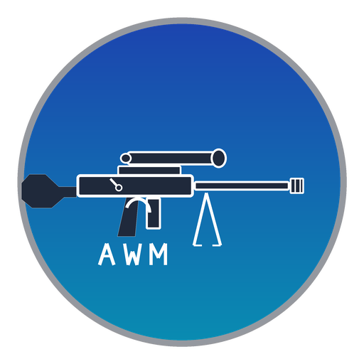
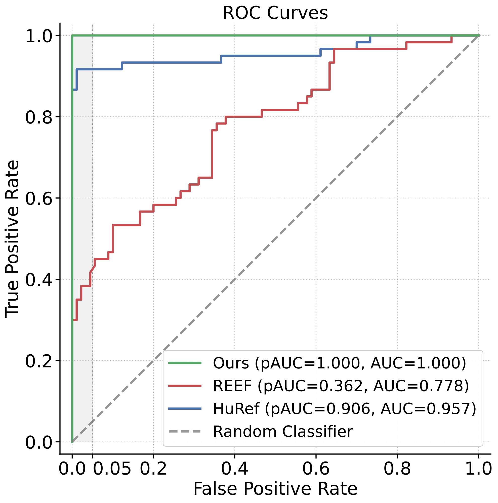

<p align="center">
  
</p>

<!-- <h2 align="center">AWM: Accurate Weight-Matrix Fingerprint for Large Language Models</h2> -->

<h3 align="center">
<b>AWM: Accurate Weight-Matrix Fingerprint for Large Language Models</b>
<br>
<b>ICLR 2026</b>
</h3>

<p align="center">
  Training-free model fingerprint with LAP-aligned unbiased CKA
</p>

<p align="center">
  <a href="https://arxiv.org/abs/2510.06738">
    </a>
  &nbsp;
  <a href="https://github.com/LUMIA-Group/AWM">
    </a>
  &nbsp;
  
  &nbsp;
  
</p>
This repository contains the official implementation for the paper "[AWM: Accurate Weight-Matrix Fingerprint for Large Language Models](https://arxiv.org/abs/2510.06738)"

`AWM` is a fingerprinting method to determine whether one large language model (LLM) is derived from another base model. The method combines Linear Assignment Problem (LAP) based dimension alignment with unbiased CKA on attention weights, and is robust to common post-training changes.

## News
- [2026.1] AWM is accepted at ICLR 2026!
- [2025.10] Code and paper released. 


## Table of Contents

- [Quick Feature Summary](#quick-feature-summary)
- [Results](#results)
  - [ROC Curves](#roc-curves)
  - [Absolute Z-score Table for correlated models](#absolute-z-score-table-for-correlated-models)
- [Installation](#installation)
- [Quick Start](#quick-start)
  - [A. Compare Two Local Models](#a-compare-two-local-models)
  - [B. Run a Predefined Experiment](#b-run-a-predefined-experiment)
- [Model Download](#model-download)
- [Experiment Suites](#experiment-suites)
- [Repository Structure](#repository-structure)
- [Citation](#citation)

## Quick Feature Summary

| Feature Category | AWM Capability |
| - | - |
| **Goal** | Independency test of open-source LLMs based on their weights |
| **Method** | 1️⃣ Linear-Assignment-Problem-based (LAP-based) alignment <br> 2️⃣ Unbiased Central Kernel Alignment (UCKA) |
|**Detectable Weights**| ✅ Attention weights <br>✅ (informal) FFN weights|
| **Computation Cost** | ✅ Training-free <br> ✅ ~30s/pair on one RTX3090|
| **Accuracy** | ✅~0 similarity scores for independent models <br> ✅High similarity scores for correlated models|
| **Robustness to <br>training recipes** | ✅ Supervised fine-tuning (SFT) <br> ✅ Continual pre-training (CPT) <br> ✅ Reinforcement learning post-training (RL)<br> ✅ Multimodal tuning <br> ✅ Pruning <br> ✅ MoE upcycling |
|**Robustness to <br>weight manipulations**| ✅ Constant scaling <br> ✅ Permutaion matrices<br> ✅ Signature matrices <br> ✅ Orthogonal matrices|


## Results
For more detailed results, please refer to the paper.
### ROC Curves
We show that our method consistently separates correlated model pairs from independent pairs across thresholds.  
In the low-false-positive region, our ROC curves stay higher and achieve larger partial AUC (pAUC), indicating stronger practical fingerprint verification performance.

<p align="center">
  <a href="./asset/roc_curves_with_real_pauc.pdf">
    
  </a>
</p>

### Absolute Z-score Table for correlated models

Absolute Z-score measures how many standard deviations a positive-pair similarity score is away from the mean of the independent-pair (negative) distribution. Larger values mean stronger statistical separation and lower ambiguity in lineage identification.

We further show that our method produces substantially larger absolute Z-scores than prior baselines. Across SFT, CPT, MoE upcycling, multimodal tuning, RL post-training, and pruning settings, we consistently achieve the strongest separation margins between correlated and independent pairs.

| Training Method | Base | Offspring | HuRef | REEF | Ours |
| - | - | - | -: | -: | -: |
| SFT | Llama2-7B | [vicuna-7b-v1.5](https://huggingface.co/lmsys/vicuna-7b-v1.5) | 44.22 | 1.95 | **355.09** |
|  | Llama2-7B | [llama-2-7b-finance](https://huggingface.co/Abira1/llama-2-7b-finance) | 44.20 | 1.94 | **355.02** |
|  | Llama2-7B | [selfrag_llama2_7b](https://huggingface.co/selfrag/selfrag_llama2_7b) | 44.47 | 1.95 | **355.20** |
|  | Llama2-7B | [LLaMA-2-7B-32K](https://huggingface.co/togethercomputer/LLaMA-2-7B-32K) | 44.22 | 1.88 | **354.84** |
|  | Llama2-7B | [WizardMath-7B-V1.0](https://huggingface.co/WizardLMTeam/WizardMath-7B-V1.0) | 44.51 | 1.95 | **355.23** |
|  | Llama2-13B | [llama-2-7b-guanaco](https://huggingface.co/mlabonne/llama-2-7b-guanaco) | 44.12 | 1.94 | **354.55** |
|  | Llama2-13B | [vicuna-13b-v1.5](https://huggingface.co/lmsys/vicuna-13b-v1.5) | 44.25 | 1.94 | **355.02** |
|  | Llama2-13B | [Nous-Hermes-Llama2-13b](https://huggingface.co/NousResearch/Nous-Hermes-Llama2-13b) | 44.48 | 1.95 | **355.20** |
|  | Llama2-13B | [LLaMA2-13B-Estopia](https://huggingface.co/KoboldAI/LLaMA2-13B-Estopia) | 43.09 | 1.91 | **343.14** |
|  | Llama2-13B | [firefly-llama2-13b](https://huggingface.co/YeungNLP/firefly-llama2-13b) | 44.51 | 1.95 | **354.59** |
| CPT | Llama2-7B | [llemma_7b](https://huggingface.co/EleutherAI/llemma_7b) | 8.15 | 1.66 | **250.32** |
|  | Llama2-7B | [CodeLlama-7b-hf](https://huggingface.co/codellama/CodeLlama-7b-hf) | 9.41 | 1.31 | **250.78** |
|  | Llama2-7B | [CodeLlama-7b-Python-hf](https://huggingface.co/meta-llama/CodeLlama-7b-Python-hf) | 9.19 | 1.77 | **253.28** |
|  | Gemma-2B | [codegemma-2b](https://huggingface.co/google/codegemma-2b) | 28.97 | 0.32 | **198.18** |
|  | Gemma-7B | [codegemma-7b](https://huggingface.co/google/codegemma-7b) | 39.51 | 1.52 | **268.72** |
|  | Qwen2.5-7B | [Qwen2.5-Math-7B](https://huggingface.co/Qwen/Qwen2.5-Math-7B) | 0.28 | 1.04 | **177.57** |
|  | Qwen2.5-7B | [Qwen2.5-Coder-7B](https://huggingface.co/Qwen/Qwen2.5-Coder-7B) | 0.57 | 1.29 | **135.17** |
|  | Qwen2-7B | [Qwen2-Math-7B](https://huggingface.co/Qwen/Qwen2-Math-7B) | 1.01 | 1.09 | **183.49** |
|  | Llama2-70B | [CodeLlama-70b-hf](https://huggingface.co/meta-llama/CodeLlama-70b-hf) | 3.43 | 1.93 | **241.12** |
|  | Llama2-70B | [CodeLlama-70b-Python-hf](https://huggingface.co/meta-llama/CodeLlama-70b-Python-hf) | 2.78 | 1.92 | **232.92** |
| MoE Upcycling | Mistral-7B | [Nous-Hermes-2-Mixtral-8x7B-DPO](https://huggingface.co/NousResearch/Nous-Hermes-2-Mixtral-8x7B-DPO) | 7.97 | 1.47 | **239.01** |
|  | Llama3-8B | [LLaMA-MoE-v2-3_8B-2_8-sft](https://huggingface.co/llama-moe/LLaMA-MoE-v2-3_8B-2_8-sft) | 42.50 | 0.47 | **332.12** |
|  | Llama2-7B | [LLaMA-MoE-v1-3_5B-4_16](https://huggingface.co/llama-moe/LLaMA-MoE-v1-3_5B-4_16) | 24.58 | 0.64 | **332.23** |
|  | Llama2-7B | [LLaMA-MoE-v1-3_0B-2_16](https://huggingface.co/llama-moe/LLaMA-MoE-v1-3_0B-2_16) | 21.59 | 0.64 | **326.49** |
|  | Llama2-7B | [LLaMA-MoE-v1-3_5B-2_8](https://huggingface.co/llama-moe/LLaMA-MoE-v1-3_5B-2_8) | 24.91 | 0.62 | **332.12** |
|  | Llama2-7B | [LLaMA-MoE-v1-3_0B-2_16-sft](https://huggingface.co/llama-moe/LLaMA-MoE-v1-3_0B-2_16-sft) | 21.59 | 0.63 | **326.49** |
|  | Llama2-7B | [LLaMA-MoE-v1-3_5B-2_8-sft](https://huggingface.co/llama-moe/LLaMA-MoE-v1-3_5B-2_8-sft) | 24.91 | 0.63 | **332.12** |
|  | Llama2-7B | [LLaMA-MoE-v1-3_5B-4_16-sft](https://huggingface.co/llama-moe/LLaMA-MoE-v1-3_5B-4_16-sft) | 24.58 | 0.62 | **332.23** |
|  | Qwen-1.8B | [Qwen1.5-MoE-A2.7B](https://huggingface.co/Qwen/Qwen1.5-MoE-A2.7B) | 4.03 | 0.57 | **173.36** |
|  | Minicpm-2B | [MiniCPM-MoE-8x2B](https://huggingface.co/openbmb/MiniCPM-MoE-8x2B) | 11.39 | 1.49 | **150.15** |
| Multimodal tuning | Llama2-7B | [llava-v1.5-7b](https://huggingface.co/liuhaotian/llava-v1.5-7b) | 44.06 | 0.40 | **354.98** |
|  | Llama2-7B | [Video-LLaVA-7B-hf](https://huggingface.co/LanguageBind/Video-LLaVA-7B-hf) | 44.03 | 0.36 | **354.98** |
|  | Qwen2-7B | [Qwen2-VL-7B-Instruct](https://huggingface.co/Qwen/Qwen2-VL-7B-Instruct) | 39.94 | 0.84 | **342.72** |
|  | Qwen-7B | [Qwen-Audio](https://huggingface.co/Qwen/Qwen-Audio) | 38.79 | 0.19 | **339.86** |
|  | Qwen-7B | [Qwen2-Audio-7B](https://huggingface.co/Qwen/Qwen2-Audio-7B) | 21.59 | 0.45 | **317.97** |
|  | Qwen-7B | [Qwen-VL](https://huggingface.co/Qwen/Qwen-VL) | 37.41 | 0.77 | **336.55** |
|  | Qwen2.5-7B | [Qwen2.5-VL-7B-Instruct](https://huggingface.co/Qwen/Qwen2.5-VL-7B-Instruct) | 24.28 | 0.48 | **290.08** |
|  | Qwen2.5-3B | [Qwen2.5-VL-3B-Instruct](https://huggingface.co/Qwen/Qwen2.5-VL-3B-Instruct) | 23.95 | 0.61 | **298.46** |
|  | Llama3-8B | [llama3-llava-next-8b-hf](https://huggingface.co/llava-hf/llama3-llava-next-8b-hf) | 44.30 | 0.26 | **355.05** |
|  | Llama2-13B | [llava-v1.5-13b](https://huggingface.co/liuhaotian/llava-v1.5-13b) | 44.09 | 0.07 | **354.91** |
| RL post-training| Open-llama3B | [hh_rlhf_rm_open_llama_3b](https://huggingface.co/weqweasdas/hh_rlhf_rm_open_llama_3b) | 44.52 | 1.94 | **355.23** |
|  | Qwen2.5-7B | [Nemotron-Research-Reasoning-Qwen-1.5B](https://huggingface.co/nvidia/Nemotron-Research-Reasoning-Qwen-1.5B) | 44.58 | 1.93 | **355.27** |
|  | Qwen2.5-1.5B | [Open-Reasoner-Zero-1.5B](https://huggingface.co/Open-Reasoner-Zero/Open-Reasoner-Zero-1.5B) | 44.58 | 1.94 | **355.27** |
|  | Mixtral | [Nous-Hermes-2-Mixtral-8x7B-DPO](https://huggingface.co/NousResearch/Nous-Hermes-2-Mixtral-8x7B-DPO) | 44.57 | 1.75 | **355.23** |
|  | Mistral-7B | [Nous-Hermes-2-Mistral-7B-DPO](https://huggingface.co/NousResearch/Nous-Hermes-2-Mistral-7B-DPO) | 44.53 | 1.48 | **355.23** |
|  | Mistral-7B | [dolphin-2.6-mistral-7b-dpo](https://huggingface.co/dphn/dolphin-2.6-mistral-7b-dpo) | 44.54 | 1.21 | **355.23** |
|  | Minicpm-2B | [MiniCPM-2B-dpo-bf16](https://huggingface.co/openbmb/MiniCPM-2B-dpo-bf16) | 44.58 | 1.92 | **355.27** |
|  | Qwen3-4B | [Qwen3_Medical_GRPO](https://huggingface.co/lastmass/Qwen3_Medical_GRPO) | 44.58 | 1.78 | **355.27** |
|  | Chatglm-6B | [chatglm-fitness-RLHF](https://huggingface.co/fb700/chatglm-fitness-RLHF) | 44.58 | 1.96 | **355.27** |
|  | Llama3-8B | [LLaMA3-iterative-DPO-final](https://huggingface.co/RLHFlow/LLaMA3-iterative-DPO-final) | 44.52 | 1.96 | **355.23** |
| Pruning | Llama-3-8B | [Llama-3.1-Minitron-4B-Depth-Base](https://huggingface.co/nvidia/Llama-3.1-Minitron-4B-Depth-Base) | 28.29 | 0.52 | **344.07** |
|  | Llama-3-8B | [Llama-3.1-Minitron-4B-Width-Base](https://huggingface.co/nvidia/Llama-3.1-Minitron-4B-Width-Base) | 22.23 | 0.53 | **343.00** |
|  | Llama-3-8B | [Llama-3.2-1B](https://huggingface.co/meta-llama/Llama-3.2-1B) | 0.33 | 1.15 | **12.14** |
|  | Llama-3-8B | [Llama-3.2-3B](https://huggingface.co/meta-llama/Llama-3.2-3B) | 0.73 | 0.92 | **106.29** |
|  | Llama2-7B | [Sheared-LLaMA-2.7B-Pruned](https://huggingface.co/princeton-nlp/Sheared-LLaMA-2.7B-Pruned) | 22.88 | 1.75 | **328.81** |
|  | Llama2-7B | [Sheared-LLaMA-2.7B-ShareGPT](https://huggingface.co/princeton-nlp/Sheared-LLaMA-2.7B-ShareGPT) | 16.00 | 1.78 | **312.44** |
|  | Llama2-7B | [Sheared-LLaMA-2.7B](https://huggingface.co/princeton-nlp/Sheared-LLaMA-2.7B) | 15.86 | 1.77 | **312.80** |
|  | Llama2-7B | [Sheared-LLaMA-1.3B-Pruned](https://huggingface.co/princeton-nlp/Sheared-LLaMA-1.3B-Pruned) | 10.06 | 1.80 | **317.79** |
|  | Llama2-7B | [Sheared-LLaMA-1.3B](https://huggingface.co/princeton-nlp/Sheared-LLaMA-1.3B) | 7.64 | 1.79 | **297.50** |
|  | Llama2-7B | [Sheared-LLaMA-1.3B-ShareGPT](https://huggingface.co/princeton-nlp/Sheared-LLaMA-1.3B-ShareGPT) | 7.64 | 1.79 | **297.50** |
## Installation

```bash
git clone https://github.com/LUMIA-Group/AWM
cd AWM
pip install -r requirements.txt
```

## Quick Start

### A. Compare Two Local Models

Download or place two model checkpoints (e.g. Llama-2-7b and CodeLlama-7b-hf) locally, then run:

```bash
python main.py \
  --model_paths ./checkpoints/Llama-2-7b ./checkpoints/CodeLlama-7b-hf \
  --device auto
```

`--device` supports `auto`, `cpu`, and `cuda`.

### B. Run a Predefined Experiment

```bash
python main.py --config sft_pairs --device auto
```

This mode uses model groups and analysis pairs defined in `configs.py`.

## Model Download

`AWM` provides two ways to prepare checkpoints.

1. Direct download with `huggingface-cli`:
```bash
huggingface-cli download meta-llama/Llama-2-7b --local-dir ./checkpoints/Llama-2-7b
huggingface-cli download codellama/CodeLlama-7b-hf --local-dir ./checkpoints/CodeLlama-7b-hf
```

2. Batch download with helper script:
```bash
chmod +x download_models.sh
./download_models.sh             # list supported config keys
./download_models.sh sft_pairs   # download models for one config
./download_models.sh all         # download all mapped models
```

Note: keep `CHECKPOINT_BASE_DIR` in `configs.py` and `download_models.sh` consistent with your local storage path.

## Experiment Suites

Predefined config keys:

- `sft_pairs`
- `cpt_pairs`
- `rl_pairs`
- `multimodal_pairs`
- `pruning_pairs`
- `all_moe_pairs`
- `sft_13b_7b_pairs`
- `independent_pairs`
- `independent_pairs_13b`

Suggested reproducibility flow:

1. Download models for one suite, e.g. `./download_models.sh cpt_pairs`.
2. Run analysis, e.g. `python main.py --config cpt_pairs --device auto`.
3. Compare summary scores in the console output (`Wq_weights`, `Wk_weights`, `Wq_Wk_weights`).

## Repository Structure

```text
AWM/
├── checkpoints/            # model checkpoints
├── asset/                  # static assets (logo/icons)
├── main.py                 # experiment entry point
├── similarity_metrics.py   # CKA, weight loading, LAP alignment
├── configs.py              # experiment definitions + model mapping
├── download_models.sh      # batch downloader for Hugging Face models
└── requirements.txt        # dependencies
```

## Citation
If you find `AWM` useful in your research or applications, we would appreciate it if you could cite our work:
```bibtex
@article{zeng2025awm,
  title={{AWM: Accurate Weight-Matrix Fingerprint for Large Language Models}},
  author={Boyi Zeng and Lin Chen and Ziwei He and Xinbing Wang and Zhouhan Lin},
  year={2025},
  journal={arXiv preprint arXiv:2510.06738},
}
```
